Назначение модуля
=================

CITORUS.Link – автономный модуль (плагин), который выполняет передачу геопространственных данных из программных продуктов, разработанных на базе платформы автоматизации CITORUS, в геоинформационную систему Quantum GIS для анализа и обработки, и передачу обработанных данных из системы Quantum GIS (далее – *QGIS*) в программные продукты CITORUS.

Установка
=========

Установка Quantum GIS
---------------------

Перед установкой модуля CITORUS.Link необходимо установить приложение Quantum GIS версии 2.

Для установки Quantum GIS выполните следующие действия:

1. Скачайте дистрибутив данного приложения по ссылке: https://qgis.org/downloads.
2. Откройте папку, в которой расположен файл дистрибутива, и запустите его выполнение двойным щелчком мыши. Далее следуйте указаниям мастера установки.

Установка модуля CITORUS.Link
-----------------------------

После завершения установки Quantum GIS установите и включите модуль CITORUS.Link. Модуль можно установить вручную или через репозиторий QGIS.

Для установки и подключения модуля вручную выполните следующие действия:

1. Разместите архивный файл **CitorusLink.zip** в папке **C:\Users\<имя пользователя>\.QGIS2\Python\plugins** и разархивируйте его.
2. Откройте приложение QGIS. Для этого в меню «Пуск» ОС Windows щелкните по ярлыку **QGIS Desktop <номер версии>**.
3. Выберите пункт главного меню **Модули > Управление модулями** (Рисунок 1).
 

           Рисунок 1 – Главное меню

4. В окне **Модули**, в меню слева выберите раздел **Установленные** (Рисунок 2).
5. В списке установленных модулей отметьте флажком модуль **CITORUS.Link**.
6. Нажмите на кнопку **Закрыть**.
 
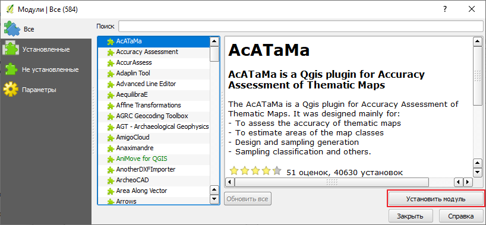

           Рисунок 2 – Окно **Модули**
		   
На панели инструментов отобразится кнопка |image1| **Развернуть/свернуть CITORUS.Link** (Рисунок 3).

Нажмите на данную кнопку, чтобы отобразить панель работы с модулем (далее – *панель CITORUS.Link*).
 

           Рисунок 3 – Панель **CitorusLink**
		   
Описание общей функциональности модуля
======================================

Загрузка слоев
--------------

Для загрузки слоев из проекта CITORUS настройте подключение к серверу проекта так, как это описано в разделе `Создание подключения к новому серверу`_.

После подключения к серверу на панели **CITORUS.Link** отобразятся слои и объекты, доступные текущему пользователю (Рисунок 4).

Для обозначения типа слоев и объектов используются следующие иконки:

|image2| – полигональный слой;
|image3| – растровый слой;
|image4| – линейный слой;
|image5| – точечный объект.

Папки, которые содержат слои и/или объекты, обозначаются иконкой |image6|. Для просмотра содержимого папки нажмите на кнопку |image7|, которая расположена слева от названия папки.
 
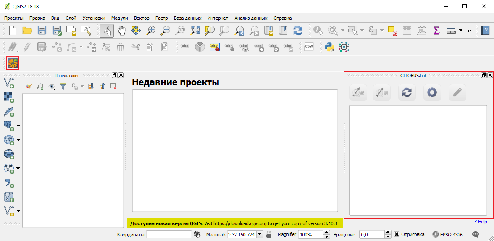

           Рисунок 4 – Список слоев
		   
Повторная загрузка слоев
------------------------

Первая загрузка слоев осуществляется автоматически при подключении к серверу проекта CITORUS. В дальнейшем для получения актуального списка слоев следует выполнять загрузку данных вручную.

Для повторной загрузки слоев нажмите на панели **CITORUS.Link** на кнопку |image8| **Обновить**.

Импорт слоев в QGIS
-------------------

Чтобы выполнить обработку слоев, загруженных с сервера, необходимо импортировать данные слои в систему QGIS.

Импорт векторного слоя
^^^^^^^^^^^^^^^^^^^^^^

Чтобы импортировать векторный слой, выделите его на панели **CITORUS.Link** и нажмите на кнопку |image9| (Рисунок 5).
 

           Рисунок 5 – Импорт слоя
		   
Модуль **CITORUS.Link** выполнит передачу слоя (Рисунок 6).
 

           Рисунок 6 – Передача слоя

После успешной передачи данных указанный слой отобразится на **Панели слоёв** QGIS (Рисунок 7).

Выполните обработку данного слоя в соответствии со сценариями, описанными в разделе `Сценарии обработки слоев`_.
 
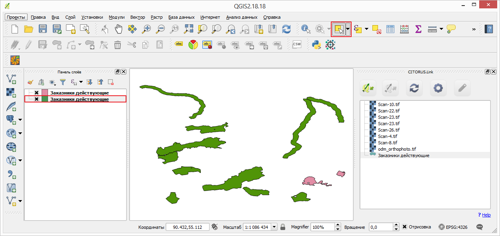

           Рисунок 7 – Загруженный слой

Импорт растрового слоя
^^^^^^^^^^^^^^^^^^^^^^

Растровый слой передается в два этапа:

- Первый этап – передача «образа» слоя (изображение PNG) для предпросмотра.
- Второй этап – передача оригинала слоя. Осуществляется, если пользователь принял решение выполнить обработку растрового слоя.

Чтобы импортировать растровый слой в систему QGIS для предпросмотра, выделите его на панели **CITORUS.Link** и нажмите на кнопку |image9| (Рисунок 5).

В окне **Импорт растрового слоя** (Рисунок 8) нажмите на кнопку **ОК**.

Растровый слой отобразится на **Панели слоёв** QGIS в режиме предпросмотра.
 

           Рисунок 8 – Импорт растрового слоя для предпросмотра
		   
Чтобы выполнить передачу оригинала растрового слоя, выделите его на **Панели слоев** QGIS и на панели **CITORUS.Link** нажмите на кнопку |image10| **Редактирование**.

В диалоговом окне, представленном на рисунке 9, нажмите на кнопку **Да**.
 
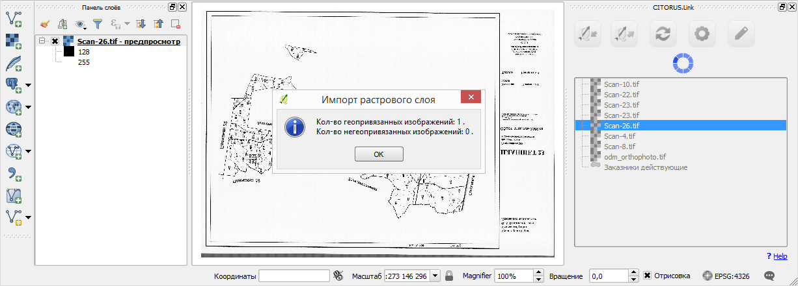

           Рисунок 9 – Диалоговое окно

Растровый слой отобразится на **Панели слоёв** QGIS в режиме редактирования (Рисунок 10).
 

           Рисунок 10 – Импорт растрового слоя для редактирования

Обработка слоев
---------------

Сценарии обработки слоев описаны в разделе `Сценарии обработки слоев`_.

Экспорт слоев из QGIS
---------------------

После обработки в QGIS слои необходимо экспортировать в проект CITORUS.

Чтобы экспортировать слой, выделите его на **Панели слоёв** QGIS и на панели **CITORUS.Link** нажмите на кнопку |image11|.
 
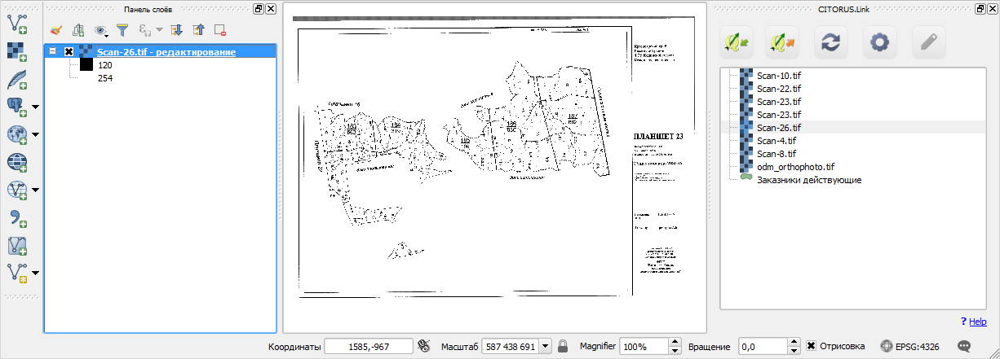

           Рисунок 11 – Экспорт слоя в проект CITORUS
		   
В диалоговом окне, представленном на рисунке 12, нажмите на кнопку **Да**.
 
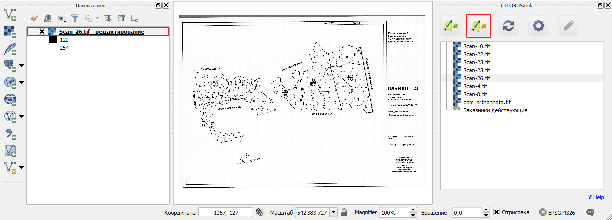

           Рисунок 12 – Диалоговое окно

Настройки модуля
----------------

Чтобы открыть меню настройки модуля, на панели **CITORUS.Link** нажмите на кнопку |image12| **Настройки** (Рисунок 13).
 
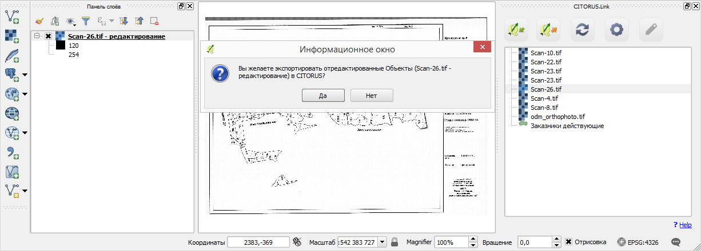

           Рисунок 13 – **Панель CITORUS.Link**
		   
Откроется окно **Меню настройки** (Рисунок 14), с помощью которого можно выполнить следующие действия:

- выбрать требуемое подключение из существующего списка подключений к серверам;
- настроить подключение к новому серверу;
- редактировать или удалить существующее подключение к серверу.
 
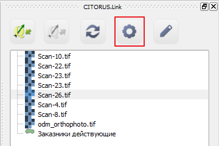

           Рисунок 14 – Окно **Меню настройки**

Подключение к серверу
^^^^^^^^^^^^^^^^^^^^^

Список существующих подключений к серверам отображается в окне **Меню настройки**, в выпадающем списке **Соединения** (Рисунок 14).

Чтобы выполнить подключение к требуемому серверу, выберите название соответствующего подключения в выпадающем списке. Затем нажмите на кнопку **ОК**.

Создание подключения к новому серверу
^^^^^^^^^^^^^^^^^^^^^^^^^^^^^^^^^^^^^

Чтобы создать подключение к новому серверу, в окне **Меню настройки** (Рисунок 14) нажмите на кнопку **Новое**.

В окне **Меню управления подключением** (Рисунок 15), в поле **URL** укажите URL-адрес сервера.
 

           Рисунок 15 – Окно **Меню управления подключением**

На стадии ввода URL осуществляется динамическая проверка доступности сервера. Если указанный адрес некорректен, выводится сообщение «Сервер недоступен» (Рисунок 16) и блокируются поля для ввода данных о подключении, расположенные ниже.
 

           Рисунок 16 – URL-адрес некорректен

Если данные корректны, выводится сообщение «Сервер доступен» и поля для ввода данных о подключении разблокируются.
 

           Рисунок 17 – URL-адрес корректен
		   
В поле **Имя подключения** укажите название подключения, которое будет отображаться в окне **Меню настройки** (Рисунок 14).

Если вход на сервер следует выполнять под учетной записью, в поле **Пользователь** укажите логин, в поле **Пароль** – пароль учетной записи пользователя. При подключении к серверу под учетной записью пользователя на панели **CITORUS.Link** отображаются слои, которые доступны данному пользователю (см. раздел `Загрузка слоев`_).

Если вход на сервер следует выполнять анонимно, поставьте флажок **Анонимный доступ**. При анонимном подключении на панели **CITORUS.Link** отображаются только те слои, которые доступны всем пользователям.

Чтобы сохранить созданное подключение, нажмите на кнопку **ОК**.

В окне **Меню настройки**, в списке подключений отобразится новое подключение (Рисунок 18).

Чтобы установить соединение с новым сервером, нажмите на кнопку **ОК**.
 
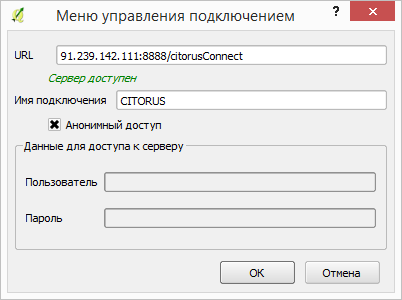

           Рисунок 18 – Окно **Меню настройки**

Редактирование настроек подключения
^^^^^^^^^^^^^^^^^^^^^^^^^^^^^^^^^^^

Чтобы редактировать настройки существующего подключения к серверу, в окне **Меню настройки** (Рисунок 18) нажмите на кнопку **Редактировать**.

В окне редактирования подключения (Рисунок 19) измените требуемые настройки и нажмите на кнопку **ОК**.
 
.. figure:: _static/19.png
           :scale: 100 %
           :align: center 

           Рисунок 19 – Окно редактирования подключения
		   
Удаление подключения
^^^^^^^^^^^^^^^^^^^^

Чтобы удалить существующее подключение, в окне **Меню настройки** (Рисунок 18) выберите требуемое подключение в выпадающем списке и нажмите на кнопку **Удалить**. Затем нажмите на кнопку **ОК**.

Сценарии обработки слоев
========================

Геопривязка растрового слоя
---------------------------

Одним из часто используемых сценариев работы с растровыми слоями является геопривязка растрового слоя к требуемому участку карты.

Рассмотрим выполнение данного сценария на следующем примере: в проекте CITORUS необходимо создать растровый слой из скан-копии планшета (формат TIF) и привязать этот слой к соответствующему участку карты, используя функциональные возможности системы Quantum GIS.

Для выполнения данной задачи необходимо выполнить следующие шаги:

1. Выполнить предварительную настройку системы QGIS для работы с растровыми слоями.
2. Создать растровый слой из TIF-файла в проекте CITORUS.
3. Импортировать созданный слой в систему QGIS.
4. Привязать слой к карте в системе QGIS.
5. Экспортировать слой в проект CITORUS.

Настройка системы QGIS
^^^^^^^^^^^^^^^^^^^^^^

Для работы с растровыми слоями необходимо выполнить предварительную настройку системы QGIS:

1. Включить модуль **Привязка растров (GDAL)**.
2. Настроить соединение с сервером, на котором содержится слой карты. Например, **Omniscale OpenStreetMap WMS**.

Чтобы включить модуль **Привязка растров (GDAL)**, выполните команду главного меню **Модули > Управление модулями** (Рисунок 20).
 
.. figure:: _static/20.png
           :scale: 100 %
           :align: center 

           Рисунок 20 – Главное меню

В окне **Модули** (Рисунок 21), в строке поиска начните вводить название модуля – **Привязка растров (GDAL)**.

В результатах поиска отметьте данный модуль флажком.

Чтобы закрыть окно **Модули**, нажмите на кнопку **Закрыть**.
 

           Рисунок 21 – Окно **Модули**
		   
Чтобы установить соединение с сервером **Omniscale OpenStreetMap WMS**, выполните команду главного меню **Слой > Добавить слой > Добавить слой WMS/WMTS** (Рисунок 22).
 

           Рисунок 22 – Главное меню

В окне **Добавить слой WMT(S)** (Рисунок 23) выберите вкладку **Поиск серверов**.

В строке поиска укажите название сервера. В рассматриваемом примере – **Omniscale OpenStreetMap WMS**. Нажмите на кнопку **Поиск**.
 
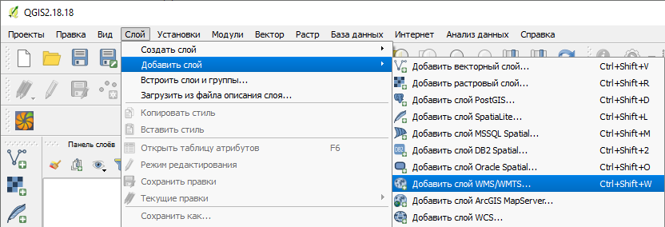

           Рисунок 23 – Окно **Добавить слой WMT(S)**
		   
Данные сервера отобразятся в списке (Рисунок 24).

Выделите строку данных сервера и нажмите на кнопку **Добавить сервер**.
 

           Рисунок 24 – Добавление сервера

Данные сервера отобразятся во вкладке **Слои** (Рисунок 25).

Чтобы закрыть окно **Добавить слой WMT(S)**, нажмите на кнопку **Закрыть**.
 

           Рисунок 25 – Вкладка **Слои**

Создание растрового слоя
^^^^^^^^^^^^^^^^^^^^^^^^

Чтобы создать растровый слой из TIF-файла в проекте CITORUS, перетащите TIF-файл в область загрузки данных, которая расположена в заголовке главного окна системы (Рисунок 26).
 

           Рисунок 26 – Загрузка слоя в систему
		   
В окне **Создание объекта Сцена** (Рисунок 27) нажмите на кнопку **Дальше**.
 

           Рисунок 27 – Окно **Создание объекта Сцена**

При успешной обработке файла отобразится всплывающее сообщение, представленное на рисунке 28.
 

           Рисунок 28 – Слой создан
		   
Созданный растровый слой отобразится в меню управления слоями, в разделе **Сцены** (Рисунок 29). В данный раздел помещаются все слои, созданные текущим пользователем.
 
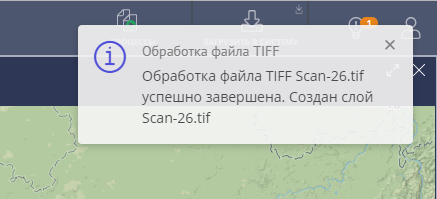

           Рисунок 29 – Меню управления слоями

Импорт слоя в систему QGIS
^^^^^^^^^^^^^^^^^^^^^^^^^^

В главном окне приложения QGIS, на панели инструментов нажмите на кнопку |image1|, чтобы отобразить панель **CITORUS.Link** (Рисунок 30).

На панели **CITORUS.Link** нажмите на кнопку |image12| **Настройки**.
 

           Рисунок 30 – Панель **CitorusLink**

В окне **Меню настройки** (Рисунок 31), в выпадающем списке **Соединения** выберите подключение к серверу проекта CITORUS и нажмите на кнопку **ОК**.
 
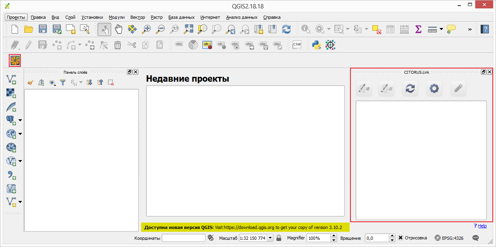

           Рисунок 31 – Окно **Меню настройки**

На панели **CITORUS.Link** (Рисунок 32) отобразятся слои, которые содержатся в разделе **Сцены** проекта CITORUS (Рисунок 29).

Выделите требуемый растровый слой и нажмите на кнопку |image9| **Импортировать в QGIS**.
 
.. figure:: _static/32.png
           :scale: 100 %
           :align: center 

           Рисунок 32 – Импорт растрового слоя для предпросмотра
		   
В окне, представленном на рисунке 33, нажмите на кнопку **ОК**.
 

           Рисунок 33 – Окно **Импорт растрового слоя**
		   
Растровый слой отобразится на **Панели слоёв** QGIS в режиме предпросмотра (Рисунок 34).

Чтобы импортировать оригинал растрового слоя для его редактирования, выделите его на **Панели слоёв** QGIS и нажмите на кнопку |image10| **Редактирование**.
 
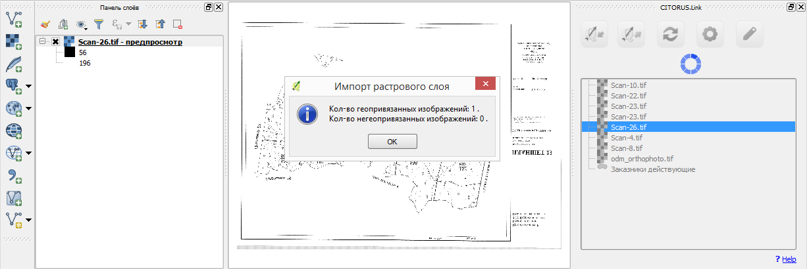

           Рисунок 34 – Импорт растрового слоя для редактирования

В окне, представленном на рисунке 35, нажмите на кнопку **Да**.
 

           Рисунок 35 – Информационное окно
		   
Растровый слой отобразится на **Панели слоёв** QGIS в режиме редактирования (Рисунок 36).
 
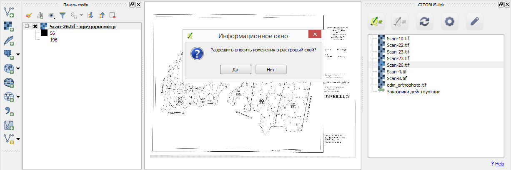

           Рисунок 36 – Растровый слой в режиме редактирования
		   
Привязка растрового слоя к карте
^^^^^^^^^^^^^^^^^^^^^^^^^^^^^^^^

Добавьте на **Панель слоёв** QGIS слой карты для привязки растрового слоя.

Для этого выполните команду главного меню **Слой > Добавить слой > Добавить слой WMS/WMTS** (Рисунок 37).
 

           Рисунок 37 – Главное меню

В окне **Добавить слой WMT(S)** (Рисунок 38), в выпадающем списке выберите сервер **Omniscale OpenStreetMap WMS** и нажмите на кнопку **Подключиться**.
 
.. figure:: _static/38.png
           :scale: 100 %
           :align: center 

           Рисунок 38 – Окно **Добавить слой WMT(S)**
		   
Ниже отобразится список слоев с указанного сервера (Рисунок 39).

Выберите в списке требуемый слой и нажмите на кнопку **Добавить**.

Чтобы закрыть окно **Добавить слой WMT(S)**, нажмите на кнопку **Закрыть**.
 

           Рисунок 39 – Включение слоя **Omniscale OpenStreetMap WMS**

На **Панели слоёв QGIS** отобразится слой карты (Рисунок 40).
 

           Рисунок 40 – Слой карты
		   
Чтобы выполнить привязку растрового слоя к карте, скопируйте путь к папке, в которой находится данный слой на вашем компьютере.

Для этого на **Панели слоёв** QGIS выделите растровый слой правой кнопкой мыши и выполните команду контекстного меню **Свойства** (Рисунок 41).
 

           Рисунок 41 – Контекстное меню слоя

В окне **Свойства слоя** (Рисунок 42) выберите вкладку **Общие**. В поле **Источник слоя** скопируйте путь к папке, в которой расположен растровый слой.

Чтобы закрыть окно, нажмите на кнопку **ОК**.
 
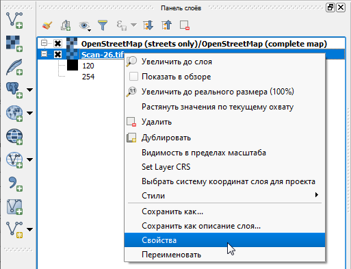

           Рисунок 42 – Окно **Свойства слоя**

Выполните команду главного меню **Растр > Привязка растров > Привязка растров** (Рисунок 43).
 

           Рисунок 43 – Главное меню

В окне **Привязка растров** (Рисунок 44) нажмите на кнопку |image13| **Открыть растр**.
 
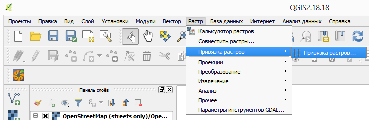

           Рисунок 44 – Кнопка **Открыть растр**
		   
В открывшемся окне Проводника Windows укажите путь к папке, скопированный в окне **Свойства слоя** (Рисунок 42). Выделите TIF-файл и нажмите на кнопку **Открыть**.

Слой отобразится в окне **Привязка слоя** (Рисунок 45).
 
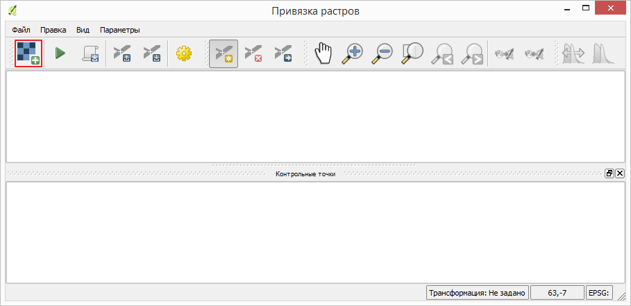

           Рисунок 45 – Окно **Привязка растров**

Сверните окно **Привязка слоя**.

В главном окне приложения QGIS установите фокус карты на территории, к которой следует привязать растровый слой.

Слой карты отображается в верхнем левом углу растрового слоя (Рисунок 46).

Увеличение/уменьшение масштаба карты осуществляется с помощью колесика мыши: прокручивание от себя увеличивает масштаб, на себя – уменьшает.

Для перемещения по карте можно использовать клавиши клавиатуры, на которых изображены стрелки, указывающие вверх, вниз, влево и вправо. Кроме того, перемещаться по карте можно, удерживая левую кнопку мыши.
 

           Рисунок 46 – Слой карты

Разверните окно **Привязка растров** и укажите первую точку привязки растрового слоя к слою карты.

Для этого щелкните мышью по требуемой точке растрового слоя (Рисунок 47).
 

           Рисунок 47 – Установка точки привязки на растровом слое
		   
В окне **Введите координаты карты** (Рисунок 48) нажмите на кнопку **С карты**.
 
.. figure:: _static/48.png
           :scale: 100 %
           :align: center 

           Рисунок 48 – Окно **Введите координаты карты**

В главном окне приложения QGIS щелкните по точке карты, которая соответствует точке привязки, указанной на растровом слое (Рисунок 49).
 
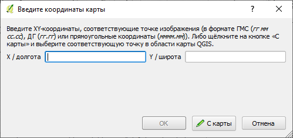

           Рисунок 49 – Установка точки привязки на карте
		   
В окне **Введите координаты карты** (Рисунок 48) нажмите на кнопку **ОК**.

Точка привязки отметится красным маркером на растровом слое (Рисунок 50) и на слое карты (Рисунок 51).

Аналогичным образом установите другие точки привязки растрового слоя к слою карты. Привязку необходимо выполнить как минимум по четырем точкам. Чем больше точек привязки будет установлено, тем точнее будет выполнена привязка растрового слоя к карте.
 

           Рисунок 50 – Точки привязки на растровом слое
 

           Рисунок 51 – Точки привязки на слое карты
		   
В окне **Привязка растров** (Рисунок 52) нажмите на панели инструментов на кнопку |image14| **Параметры трансформации**.
 
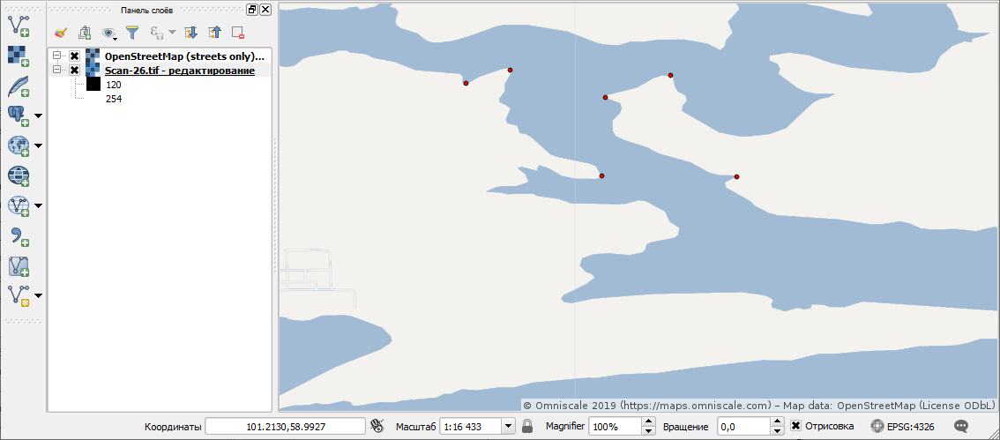

           Рисунок 52 – Окно **Привязка растров**

В окне **Параметры трансформации** (Рисунок 53) нажмите на кнопку |image15| справа от поля **Целевой растр**.
 

           Рисунок 53 – Окно **Параметры трансформации**

В открывшемся Проводнике Windows (Рисунок 54) нажмите на кнопку **Сохранить**.
 

           Рисунок 54 – Проводник Windows
		   
В выпадающем списке **Тип трансформации** выберите значение **Линейная** (Рисунок 55).

В выпадающем списке **Целевая система координат** выберите систему координат **WGS 84** (ID источника – **EPSG 4326**).

Для этого нажмите на кнопку |image16| **Выбрать систему координат** справа от поля **Целевая система координат**.
 

           Рисунок 55 – Настройки параметров трансформации

В окне **Выбор системы координат** (Рисунок 56), в строке поиска введите **EPSG 4326** и нажмите на кнопку **ОК**.
 
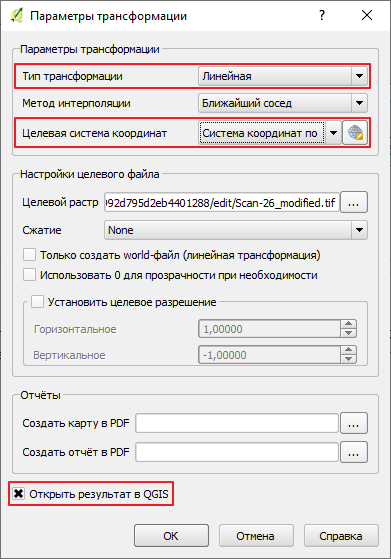

           Рисунок 56 – Окно **Выбор системы координат**

В окне **Параметры трансформации** (Рисунок 55) поставьте флажок **Открыть результат в QGIS** и нажмите на кнопку **ОК**.

В окне **Привязка растров** (Рисунок 57) нажмите на кнопку |image17| **Начать привязку растра**.
 

           Рисунок 57 – Окно **Привязка растров**

Дождитесь окончания привязки растра и закройте окно **Привязка растров**.

В главном окне приложения QGIS, на **Панели слоёв** отобразится модифицированный слой (Рисунок 58).

Экспорт слоя в систему CITORUS
^^^^^^^^^^^^^^^^^^^^^^^^^^^^^^

Чтобы экспортировать модифицированный растровый слой в систему CITORUS, откройте контекстное меню данного слоя щелчком правой кнопки мыши и выполните команду **Переименовать**.

Укажите для данного слоя название в формате: **<имя слоя>.tif - редактирование**. Например, **Scan-26.tif - редактирование**.

Чтобы сохранить название, нажмите на клавишу **Enter**.
 
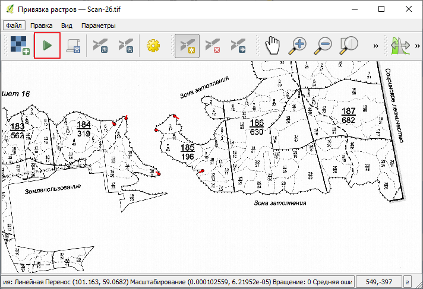

           Рисунок 58 – Контекстное меню слоя

Выделите модифицированный слой на **Панели сло`в** QGIS и на панели **CITORUS.Link** нажмите на кнопку |image11| **Экспортировать в CITORUS** (Рисунок 59).
 

           Рисунок 59 – Экспорт слоя

В окне, представленном на рисунке 60, нажмите на кнопку **Да**.
 

           Рисунок 60 – Информационное окно
		   
В окне **Экспорт** (Рисунок 61) нажмите на кнопку **ОК**.
 
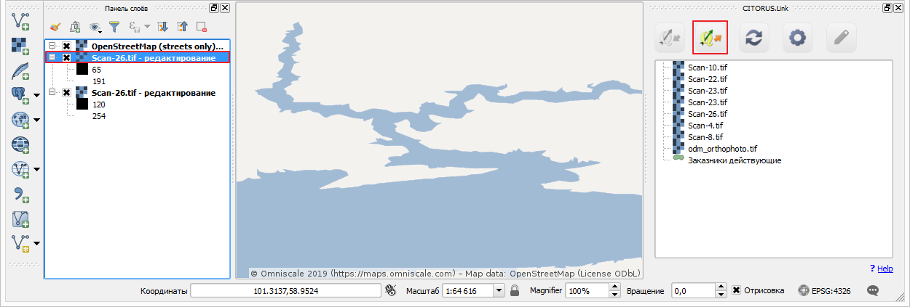

           Рисунок 61 – Окно **Экспорт**
		   
Чтобы просмотреть слой на карте в проекте CITORUS, выполните следующие действия:

1. В главном окне системы CITORUS установите фокус карты на территории, которая соответствует территории растрового слоя (Рисунок 62).
2. Разверните панель управления слоями.
3. В разделе **Сцены** нажмите на кнопку |image18| справа от модифицированного слоя.

Растровый слой отобразится на карте.
 

           Рисунок 62 – Растровый слой на карте
		   
Редактирование векторного слоя
------------------------------

Система Quantum GIS используется для изменения атрибутивной и/или геопространственной информации векторных слоев, созданных в проектах CITORUS. Работа с векторными слоями в системе Quantum GIS подробно описана в документации производителя системы: https://qgis.org/ru/docs/index.html.

Для редактирования векторного слоя выполните следующие действия:

1. Выполните подключение к серверу проекта CITORUS, на котором расположен требуемый векторный слой (см. раздел `Подключение к серверу`_).
2. Выполните импорт слоя из проекта CITORUS в систему QGIS (см. раздел `Импорт векторного слоя`_).
3. Редактируйте векторный слой.
4. Выполните экспорт слоя в проект CITORUS (см. раздел `Экспорт слоев из QGIS`_).

Журнал изменений
================

+-----------+--------------+----------------------------------------+
| Версия    | Дата         | Исправления                            |
+===========+==============+========================================+
| v.1.000   | 30.12.2019   | Размещение исходной версии документа   |
+-----------+--------------+----------------------------------------+

.. |image1| image:: https://github.com/citoruspm/link/blob/master/source/_static/button_1.png?raw=true
.. |image2| image:: https://github.com/citoruspm/link/blob/master/source/_static/button_2.png?raw=true
.. |image3| image:: https://github.com/citoruspm/link/blob/master/source/_static/button_3.png?raw=true
.. |image4| image:: https://github.com/citoruspm/link/blob/master/source/_static/button_4.png?raw=true
.. |image5| image:: https://github.com/citoruspm/link/blob/master/source/_static/button_5.png?raw=true
.. |image6| image:: https://github.com/citoruspm/link/blob/master/source/_static/button_6.png?raw=true
.. |image7| image:: https://github.com/citoruspm/link/blob/master/source/_static/button_7.png?raw=true
.. |image8| image:: https://github.com/citoruspm/link/blob/master/source/_static/button_8.png?raw=true
.. |image9| image:: https://github.com/citoruspm/link/blob/master/source/_static/button_9.png?raw=true
.. |image10| image:: https://github.com/citoruspm/link/blob/master/source/_static/button_10.png?raw=true
.. |image11| image:: https://github.com/citoruspm/link/blob/master/source/_static/button_11.png?raw=true
.. |image12| image:: https://github.com/citoruspm/link/blob/master/source/_static/button_12.png?raw=true
.. |image13| image:: https://github.com/citoruspm/link/blob/master/source/_static/button_13.png?raw=true
.. |image14| image:: https://github.com/citoruspm/link/blob/master/source/_static/button_14.png?raw=true
.. |image15| image:: https://github.com/citoruspm/link/blob/master/source/_static/button_15.png?raw=true
.. |image16| image:: https://github.com/citoruspm/link/blob/master/source/_static/button_16.png?raw=true
.. |image17| image:: https://github.com/citoruspm/link/blob/master/source/_static/button_17.png?raw=true
.. |image18| image:: https://github.com/citoruspm/link/blob/master/source/_static/button_17.png?raw=true
